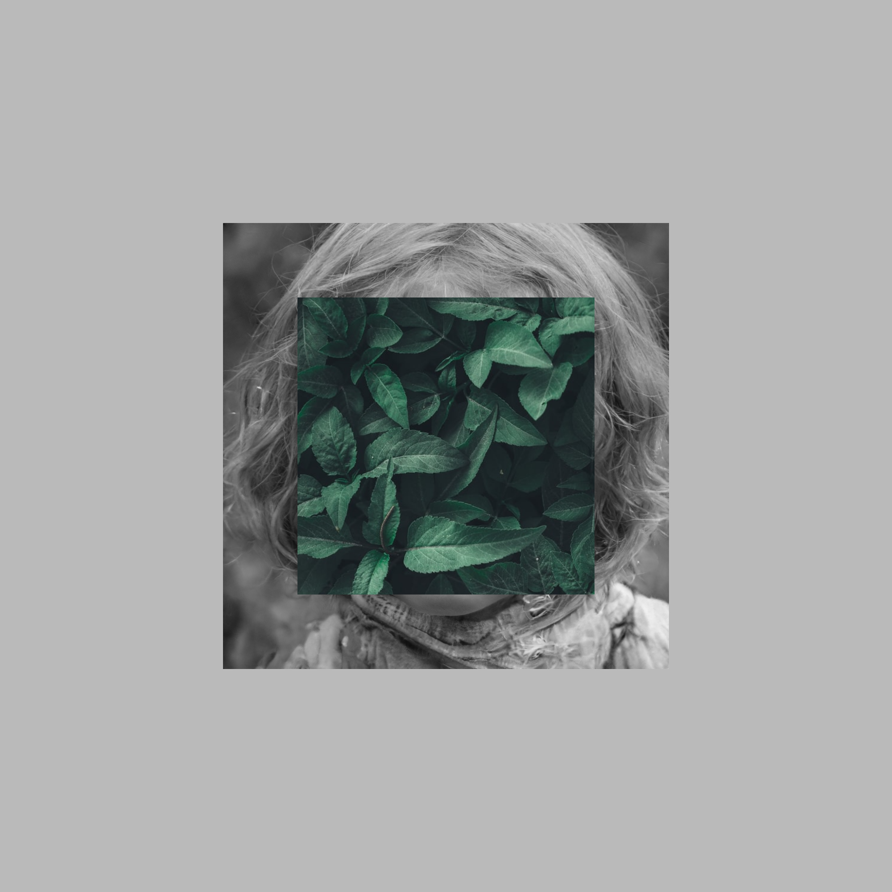
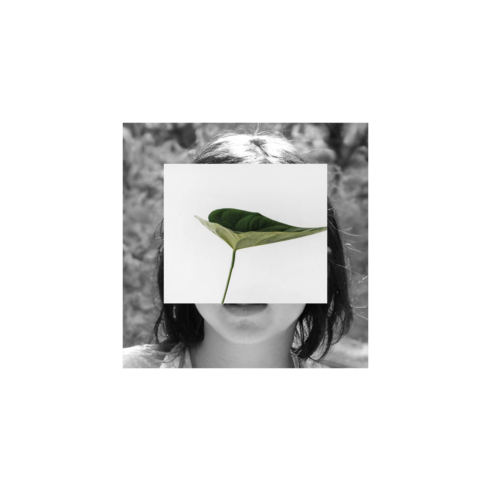
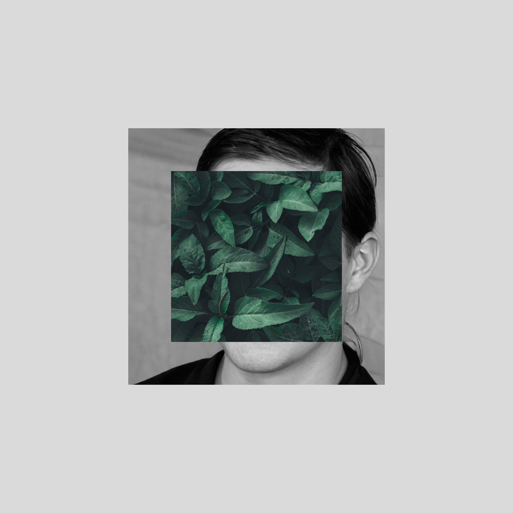
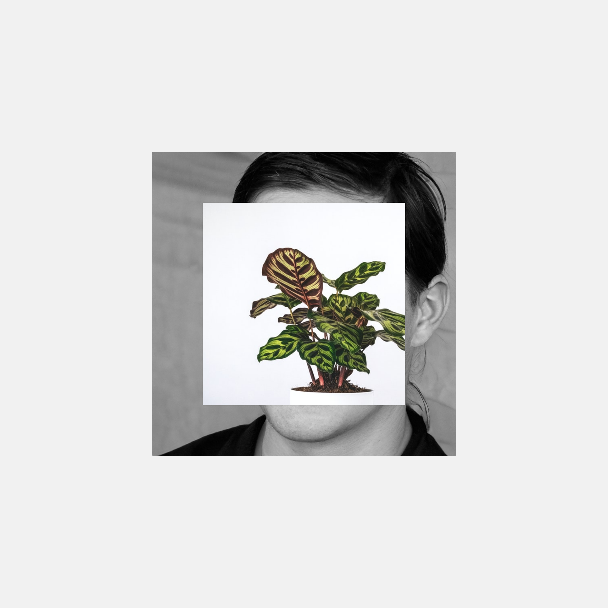

<p align="center">
  


<h1 align="center"> Impala </h1> <br>

<p align="center">
Impala creates artistic images using p5.js
</p>

<p align="center" >
    
    
    
    

  


### Installation

```bash
$ git clone https://github.com/daehruoydeef/Impala
$ cd Impala
$ mkdir portraits plants
$ sh getImages.sh
```

> You will need to add in the plant images yourself, the getImages script will only fetch random images from.

### Usage

Serve index.htm with a server of your choice, refreshing the page will generate a new picture.

### Example Images

|  |  |
| --------------- | --------------- |
|  |  |
|  |  |

